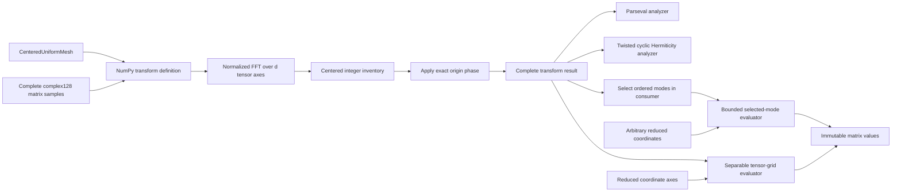
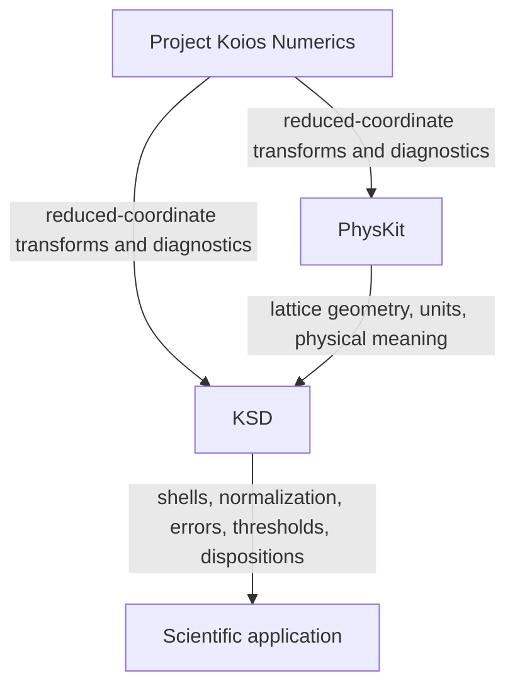

# Centered uniform transform schematics

## Forward and inverse flow

```mermaid
flowchart LR
    M[CenteredUniformMesh] --> D[NumPy transform definition]
    S[Complete complex128 matrix samples] --> D
    D --> F[Normalized FFT over d tensor axes]
    F --> C[Centered integer inventory]
    C --> O[Apply exact origin phase]
    O --> R[Complete transform result]
    R --> P[Parseval analyzer]
    R --> H[Twisted cyclic Hermiticity analyzer]
    R --> Q[Select ordered modes in consumer]
    Q --> E[Bounded selected-mode evaluator]
    X[Arbitrary reduced coordinates] --> E
    R --> T[Separable tensor-grid evaluator]
    A[Reduced coordinate axes] --> T
    E --> V[Immutable matrix values]
    T --> V
```

## Class relationships

```mermaid
classDiagram
    class CenteredUniformMesh {
        +int dimension
        +int size
        +tuple offsets
        +point_count int
        +coordinate_origin tuple
    }
    class NumpyCenteredUniformMeshMatrixFourierTransformDefinition {
        +CenteredUniformMesh mesh
        +complex128 matrix_samples
        +from_array()
        +from_immutable_array()
    }
    class NumpyFiniteFourierMatrixSeries {
        +int dimension
        +int64 integer_modes
        +complex128 matrix_coefficients
        +term_count int
        +matrix_size int
    }
    class NumpyCenteredUniformMeshMatrixFourierTransformResult {
        +CenteredUniformMesh mesh
        +NumpyFiniteFourierMatrixSeries series
        +str backend_identifier
        +str backend_version
    }
    class NumpyCenteredUniformMeshMatrixFourierTransformer {
        +transform(definition) Result
    }
    class NumpyFiniteFourierMatrixEvaluationDefinition {
        +NumpyFiniteFourierMatrixSeries series
        +float64 coordinates
        +int maximum_phase_elements
    }
    class NumpyFiniteFourierMatrixSeriesEvaluator {
        +evaluate(definition) EvaluationResult
    }
    class NumpyTensorProductFourierMatrixEvaluationDefinition {
        +CenteredUniformMesh source_mesh
        +NumpyFiniteFourierMatrixSeries series
        +tuple coordinate_axes
        +int maximum_working_elements
    }
    class NumpyTensorProductFourierMatrixSeriesEvaluator {
        +evaluate(definition) EvaluationResult
    }
    class NumpyFinitePeriodicParsevalAnalyzer {
        +analyze(definition, result) ParsevalDiagnostics
    }
    class NumpyCenteredUniformMeshHermiticityAnalyzer {
        +analyze(result) HermiticityDiagnostics
    }

    NumpyCenteredUniformMeshMatrixFourierTransformDefinition --> CenteredUniformMesh
    NumpyCenteredUniformMeshMatrixFourierTransformer --> NumpyCenteredUniformMeshMatrixFourierTransformDefinition
    NumpyCenteredUniformMeshMatrixFourierTransformer --> NumpyCenteredUniformMeshMatrixFourierTransformResult
    NumpyCenteredUniformMeshMatrixFourierTransformResult --> NumpyFiniteFourierMatrixSeries
    NumpyFiniteFourierMatrixEvaluationDefinition --> NumpyFiniteFourierMatrixSeries
    NumpyFiniteFourierMatrixSeriesEvaluator --> NumpyFiniteFourierMatrixEvaluationDefinition
    NumpyTensorProductFourierMatrixEvaluationDefinition --> CenteredUniformMesh
    NumpyTensorProductFourierMatrixEvaluationDefinition --> NumpyFiniteFourierMatrixSeries
    NumpyTensorProductFourierMatrixSeriesEvaluator --> NumpyTensorProductFourierMatrixEvaluationDefinition
```

## Ownership boundary

```mermaid
flowchart TB
    N[Project Koios Numerics]
    P[PhysKit]
    K[KSD]

    N -->|reduced-coordinate transforms and diagnostics| P
    N -->|reduced-coordinate transforms and diagnostics| K
    P -->|lattice geometry, units, physical meaning| K
    K -->|shells, normalization, errors, thresholds, dispositions| A[Scientific application]
```
