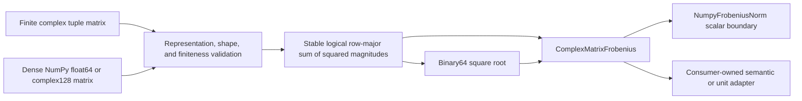

# Frobenius schematics

```mermaid
flowchart LR
    T[Finite complex tuple matrix] --> V[Representation, shape, and finiteness validation]
    D[Dense NumPy float64 or complex128 matrix] --> V
    V --> P[Stable logical row-major sum of squared magnitudes]
    P --> N[Binary64 square root]
    P --> R[ComplexMatrixFrobenius]
    N --> R
    R --> E[NumpyFrobeniusNorm scalar boundary]
    R --> C[Consumer-owned semantic or unit adapter]
```

The consumer adapter is outside Numerics and cannot alter the retained unit-free power
or norm.
