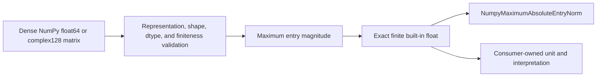

# Maximum-absolute-entry schematics

```mermaid
flowchart LR
    D[Dense NumPy float64 or complex128 matrix]
    V[Representation, shape, dtype, and finiteness validation]
    M[Maximum entry magnitude]
    F[Exact finite built-in float]
    E[NumpyMaximumAbsoluteEntryNorm]
    C[Consumer-owned unit and interpretation]

    D --> V --> M --> F
    F --> E
    F --> C
```
