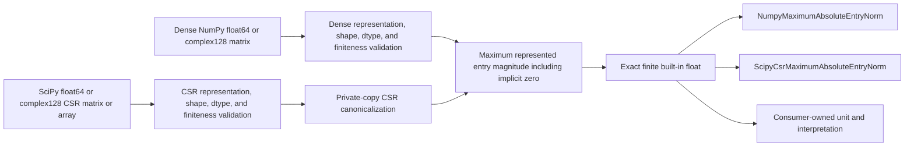

# Maximum-absolute-entry schematics

```mermaid
flowchart LR
    D[Dense NumPy float64 or complex128 matrix]
    S[SciPy float64 or complex128 CSR matrix or array]
    K[Private-copy CSR canonicalization]
    V[Dense representation, shape, dtype, and finiteness validation]
    W[CSR representation, shape, dtype, and finiteness validation]
    M[Maximum represented entry magnitude including implicit zero]
    F[Exact finite built-in float]
    E[NumpyMaximumAbsoluteEntryNorm]
    Q[ScipyCsrMaximumAbsoluteEntryNorm]
    C[Consumer-owned unit and interpretation]

    D --> V --> M --> F
    S --> W --> K --> M
    F --> E
    F --> Q
    F --> C
```
