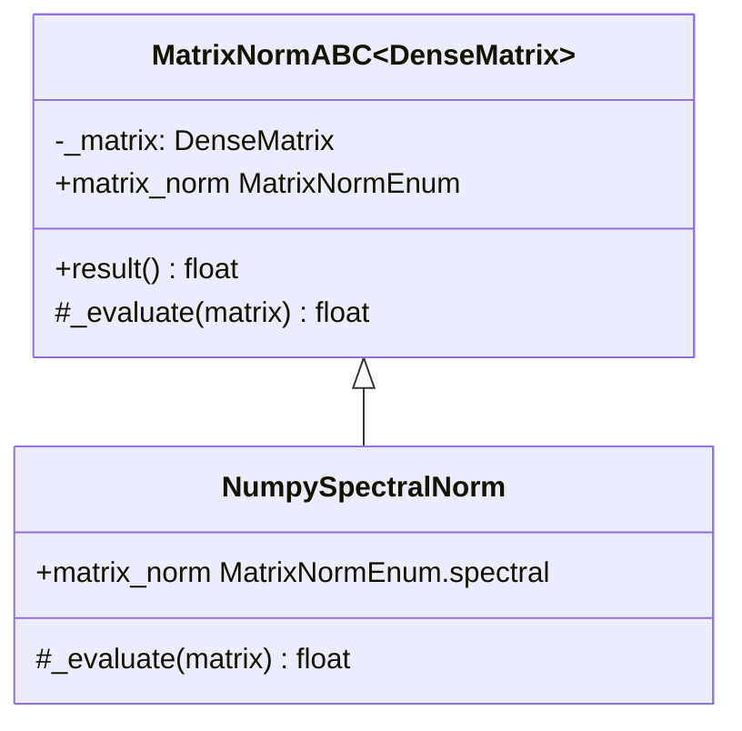
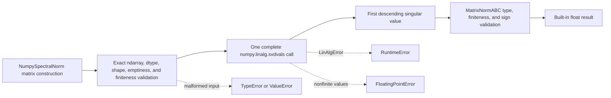

# `NumpySpectralNorm` schematics

## Class relation

```mermaid
classDiagram
    class MatrixNormABC~DenseMatrix~ {
        -_matrix: DenseMatrix
        +result() float
        +matrix_norm MatrixNormEnum
        #_evaluate(matrix) float
    }
    class NumpySpectralNorm {
        +matrix_norm MatrixNormEnum.spectral
        #_evaluate(matrix) float
    }

    MatrixNormABC <|-- NumpySpectralNorm
```

## Call flow

```mermaid
flowchart LR
    A[NumpySpectralNorm matrix construction]
    V[Exact ndarray, dtype, shape, emptiness, and finiteness validation]
    S[One complete numpy.linalg.svdvals call]
    L[First descending singular value]
    B[MatrixNormABC type, finiteness, and sign validation]
    R[Built-in float result]

    A --> V --> S --> L --> B --> R
    V -. malformed input .-> X[TypeError or ValueError]
    S -. LinAlgError .-> C[RuntimeError]
    S -. nonfinite values .-> F[FloatingPointError]
```
