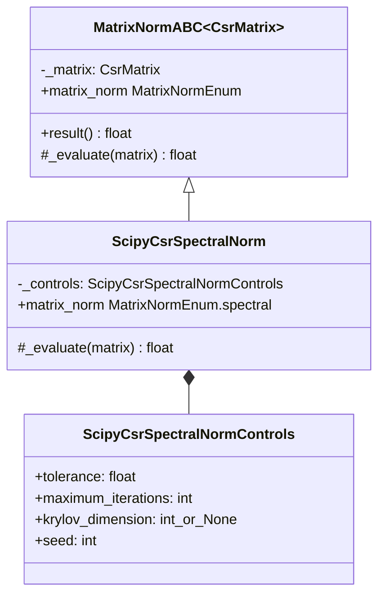
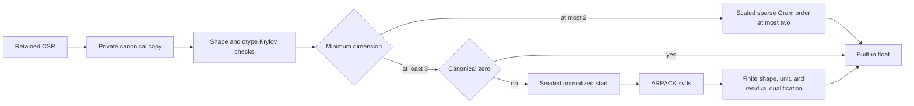

# `ScipyCsrSpectralNorm` schematics

## Class relation

```mermaid
classDiagram
    class MatrixNormABC~CsrMatrix~ {
        -_matrix: CsrMatrix
        +result() float
        +matrix_norm MatrixNormEnum
        #_evaluate(matrix) float
    }
    class ScipyCsrSpectralNormControls {
        +tolerance: float
        +maximum_iterations: int
        +krylov_dimension: int_or_None
        +seed: int
    }
    class ScipyCsrSpectralNorm {
        -_controls: ScipyCsrSpectralNormControls
        +matrix_norm MatrixNormEnum.spectral
        #_evaluate(matrix) float
    }

    MatrixNormABC <|-- ScipyCsrSpectralNorm
    ScipyCsrSpectralNorm *-- ScipyCsrSpectralNormControls
```

## Evaluation flow

```mermaid
flowchart LR
    A[Retained CSR]
    C[Private canonical copy]
    K[Shape and dtype Krylov checks]
    Z{Canonical zero}
    M{Minimum dimension}
    G[Scaled sparse Gram order at most two]
    S[Seeded normalized start]
    V[ARPACK svds]
    Q[Finite shape, unit, and residual qualification]
    R[Built-in float]

    A --> C --> K --> M
    M -->|at most 2| G --> R
    M -->|at least 3| Z
    Z -->|yes| R
    Z -->|no| S --> V --> Q --> R
```
