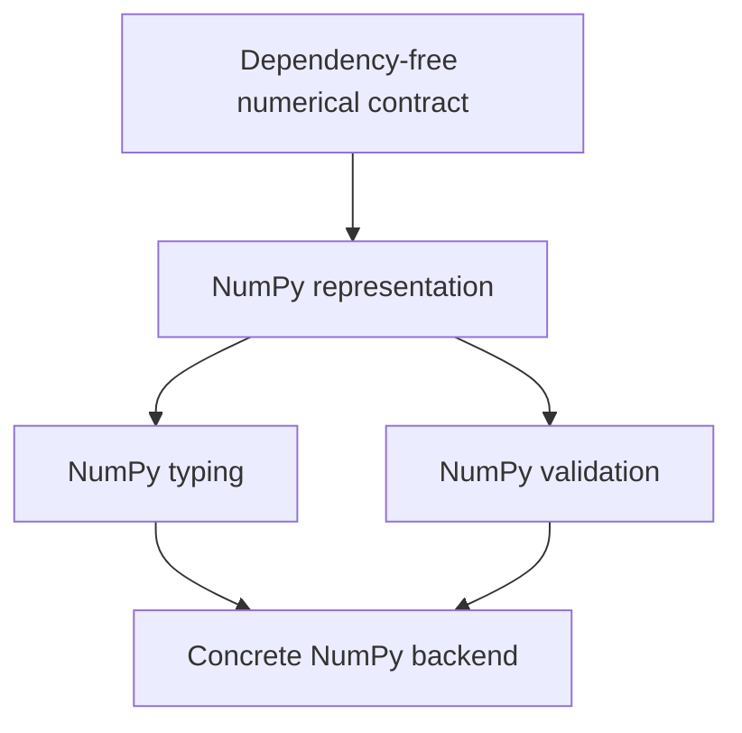

# Schematics

```mermaid
flowchart TD
    Contract[Dependency-free numerical contract] --> Representation[NumPy representation]
    Representation --> Typing[NumPy typing]
    Representation --> Validation[NumPy validation]
    Typing --> Backend[Concrete NumPy backend]
    Validation --> Backend
```
