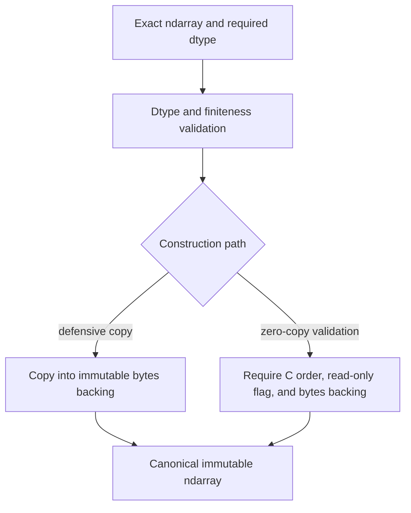

# Schematics

```mermaid
flowchart TD
    Input[Exact ndarray and required dtype] --> Dtype[Dtype and finiteness validation]
    Dtype --> Copy{Construction path}
    Copy -->|defensive copy| Bytes[Copy into immutable bytes backing]
    Copy -->|zero-copy validation| Canonical[Require C order, read-only flag, and bytes backing]
    Bytes --> Array[Canonical immutable ndarray]
    Canonical --> Array
```
