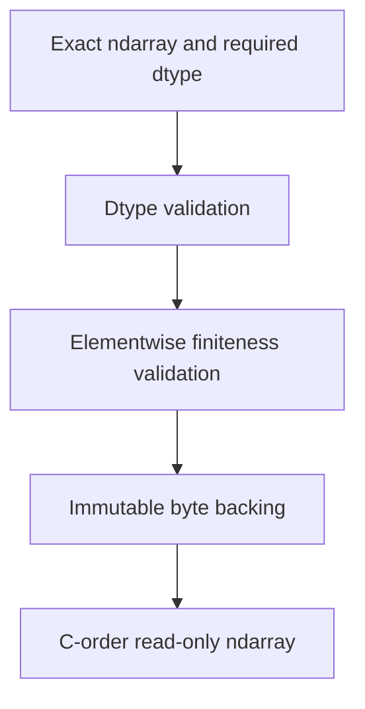

# Schematics

```mermaid
flowchart TD
    Input[Exact ndarray and required dtype] --> Dtype[Dtype validation]
    Dtype --> Finite[Elementwise finiteness validation]
    Finite --> Bytes[Immutable byte backing]
    Bytes --> Copy[C-order read-only ndarray]
```
