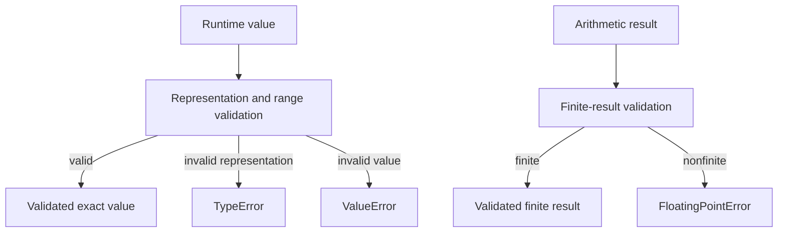

# Schematics

```mermaid
flowchart TD
    Runtime[Runtime value] --> Validate[Representation and range validation]
    Validate -->|valid| Exact[Validated exact value]
    Validate -->|invalid representation| TypeError[TypeError]
    Validate -->|invalid value| ValueError[ValueError]
    Arithmetic[Arithmetic result] --> Finite[Finite-result validation]
    Finite -->|finite| Result[Validated finite result]
    Finite -->|nonfinite| FloatingPointError[FloatingPointError]
```
