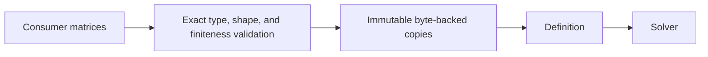

# Definition schematics

```mermaid
flowchart LR
    C[Consumer matrices] --> V[Exact type, shape, and finiteness validation]
    V --> I[Immutable byte-backed copies]
    I --> D[Definition]
    D --> S[Solver]
```

Consumer semantics remain outside the record.
