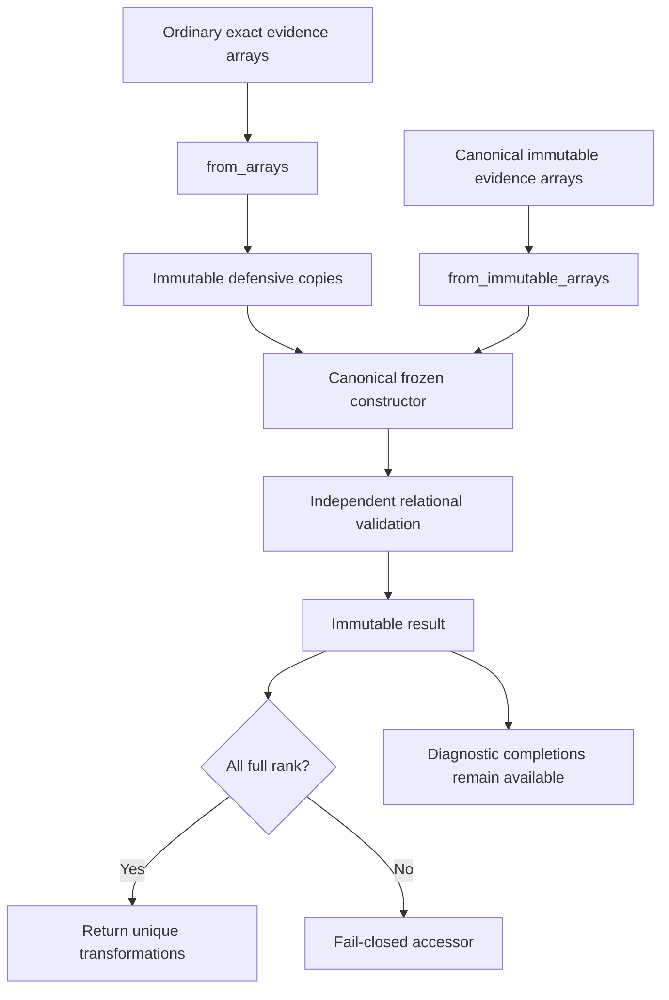

# Result schematics

```mermaid
flowchart TD
    Ordinary[Ordinary exact evidence arrays] --> Copy[from_arrays]
    Copy --> Defensive[Immutable defensive copies]
    Canonical[Canonical immutable evidence arrays] --> Zero[from_immutable_arrays]
    Defensive --> Raw[Canonical frozen constructor]
    Zero --> Raw
    Raw --> Validate[Independent relational validation]
    Validate --> Result[Immutable result]
    Result --> Rank{All full rank?}
    Rank -- Yes --> Unique[Return unique transformations]
    Rank -- No --> Fail[Fail-closed accessor]
    Result --> Diagnostic[Diagnostic completions remain available]
```
