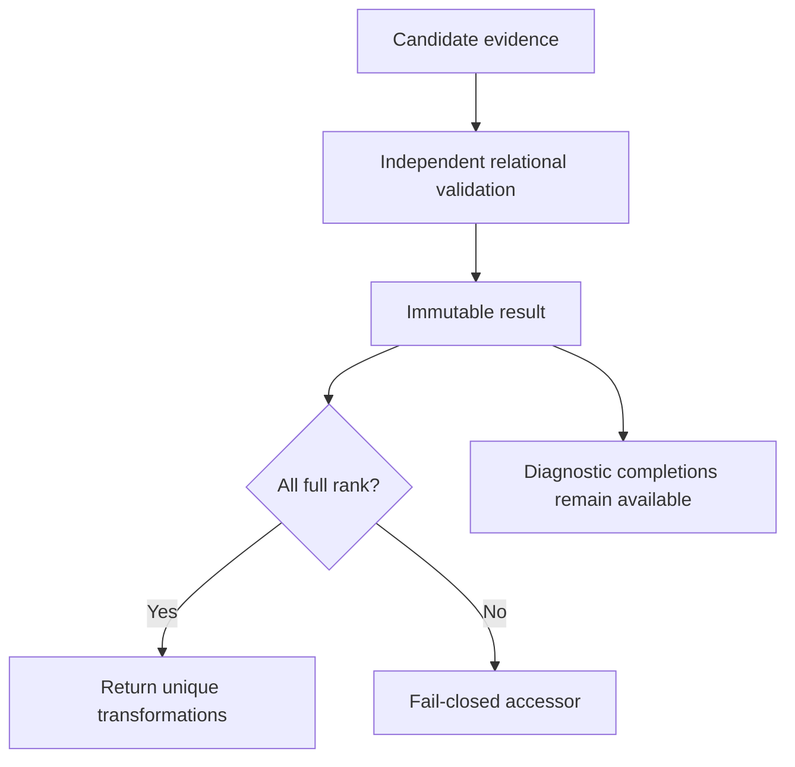

# Result schematics

```mermaid
flowchart TD
    E[Candidate evidence] --> V[Independent relational validation]
    V --> I[Immutable result]
    I --> R{All full rank?}
    R -- Yes --> U[Return unique transformations]
    R -- No --> F[Fail-closed accessor]
    I --> D[Diagnostic completions remain available]
```
