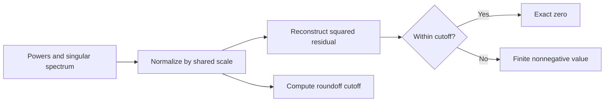

# ResidualReconstruction schematics

```mermaid
flowchart LR
    P[Powers and singular spectrum] --> S[Normalize by shared scale]
    S --> R[Reconstruct squared residual]
    S --> C[Compute roundoff cutoff]
    R --> G{Within cutoff?}
    G -- Yes --> Z[Exact zero]
    G -- No --> E[Finite nonnegative value]
```
