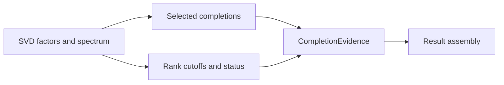

# CompletionEvidence schematics

```mermaid
flowchart LR
    S[SVD factors and spectrum] --> C[Selected completions]
    S --> K[Rank cutoffs and status]
    C --> E[CompletionEvidence]
    K --> E
    E --> R[Result assembly]
```
