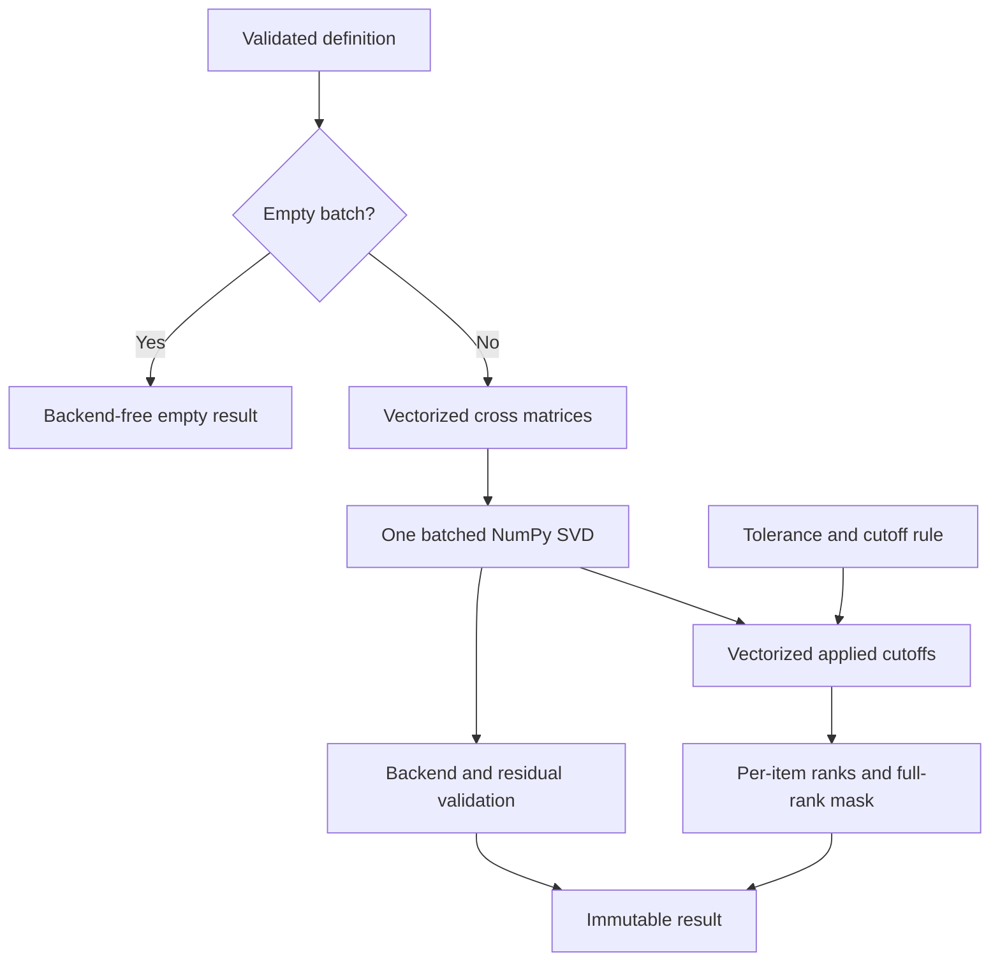

# Solver schematics

```mermaid
flowchart TD
    D[Validated definition] --> E{Empty batch?}
    E -- Yes --> R0[Backend-free empty result]
    E -- No --> X[Vectorized cross matrices]
    X --> S[One batched NumPy SVD]
    S --> V[Backend and residual validation]
    T[Tolerance and cutoff rule] --> K[Vectorized applied cutoffs]
    S --> K
    K --> Q[Per-item ranks and full-rank mask]
    V --> R[Immutable result]
    Q --> R
```
