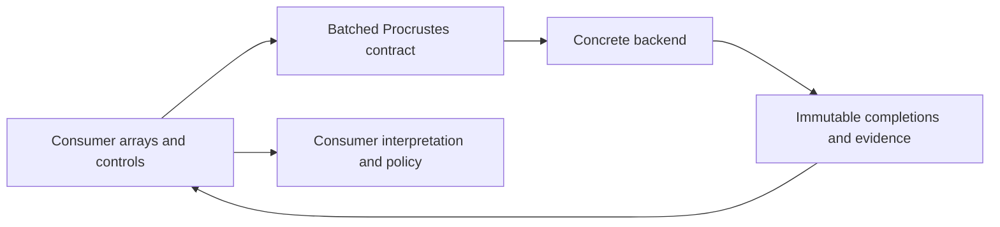
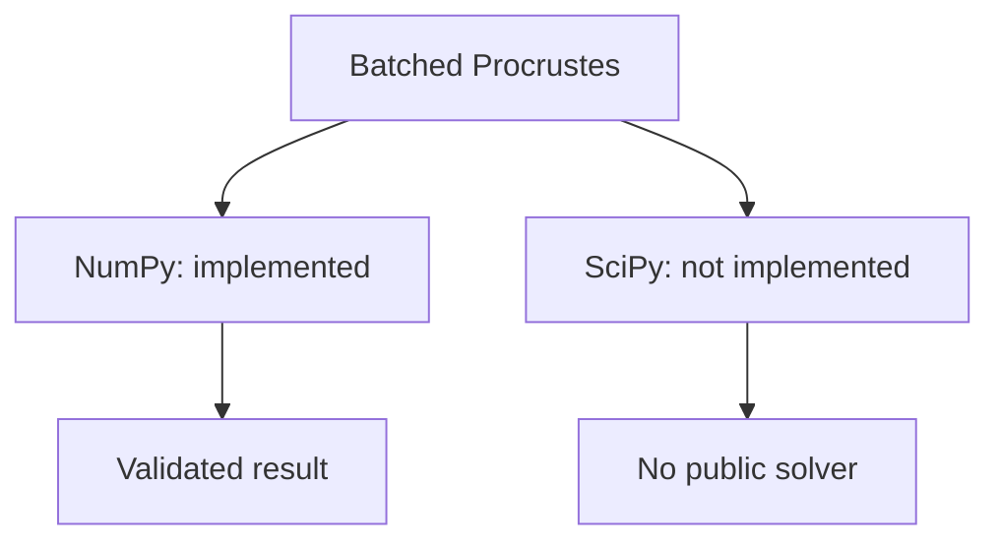

# Batched Procrustes schematics

The capability keeps consumer semantics outside its mathematical and backend boundaries.

```mermaid
flowchart LR
    C[Consumer arrays and controls] --> B[Batched Procrustes contract]
    B --> N[Concrete backend]
    N --> E[Immutable completions and evidence]
    E --> C
    C --> P[Consumer interpretation and policy]
```

Backend ownership is explicit rather than selected implicitly.

```mermaid
flowchart TD
    A[Batched Procrustes] --> NP[NumPy: implemented]
    A --> SP[SciPy: not implemented]
    NP --> R[Validated result]
    SP --> X[No public solver]
```
