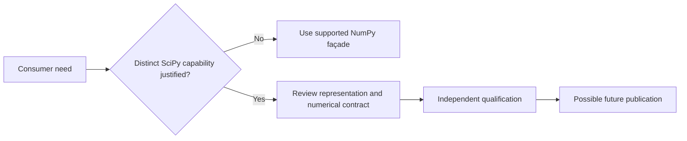

# SciPy batched Procrustes schematics

The absent backend is an explicit boundary rather than an implicit fallback.

```mermaid
flowchart LR
    C[Consumer need] --> D{Distinct SciPy capability justified?}
    D -- No --> N[Use supported NumPy façade]
    D -- Yes --> R[Review representation and numerical contract]
    R --> Q[Independent qualification]
    Q --> P[Possible future publication]
```
