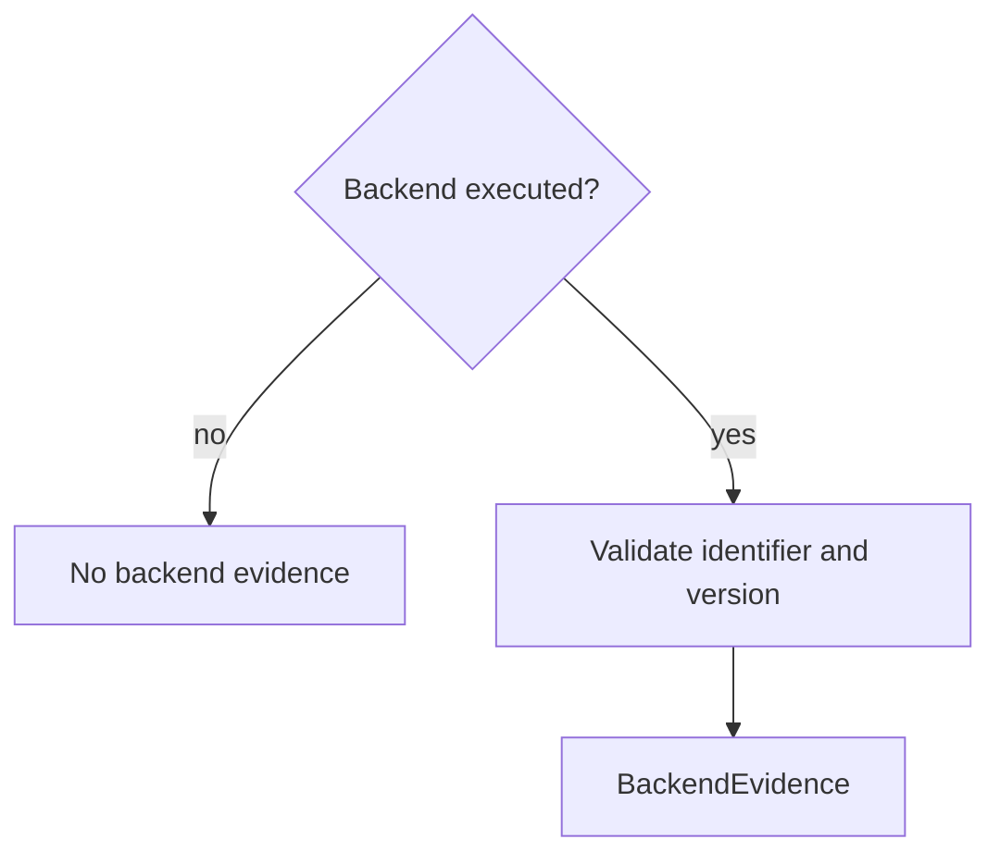

# Schematics

```mermaid
flowchart TD
    Executed{Backend executed?}
    Executed -->|no| Absent[No backend evidence]
    Executed -->|yes| Validate[Validate identifier and version]
    Validate --> Evidence[BackendEvidence]
```
