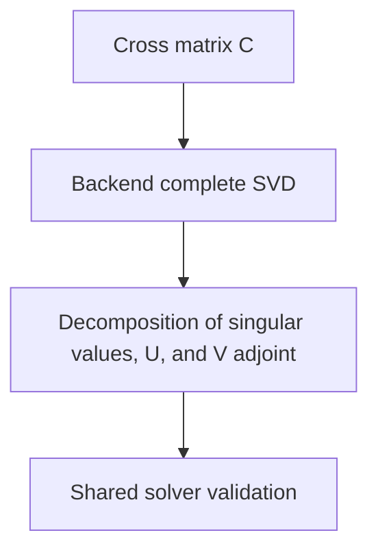

# Schematics

```mermaid
flowchart TD
    Cross[Cross matrix C] --> SVD[Backend complete SVD]
    SVD --> Decomposition[Decomposition of singular values, U, and V adjoint]
    Decomposition --> Validation[Shared solver validation]
```
