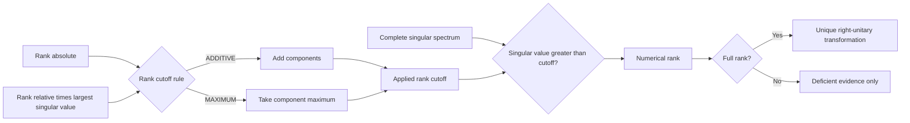

# Rank-cutoff rule schematic

```mermaid
flowchart LR
    A[Rank absolute] --> R{Rank cutoff rule}
    B[Rank relative times largest singular value] --> R
    R -->|ADDITIVE| S[Add components]
    R -->|MAXIMUM| M[Take component maximum]
    S --> C[Applied rank cutoff]
    M --> C
    V[Complete singular spectrum] --> G{Singular value greater than cutoff?}
    C --> G
    G --> N[Numerical rank]
    N --> F{Full rank?}
    F -->|Yes| U[Unique right-unitary transformation]
    F -->|No| D[Deficient evidence only]
```
