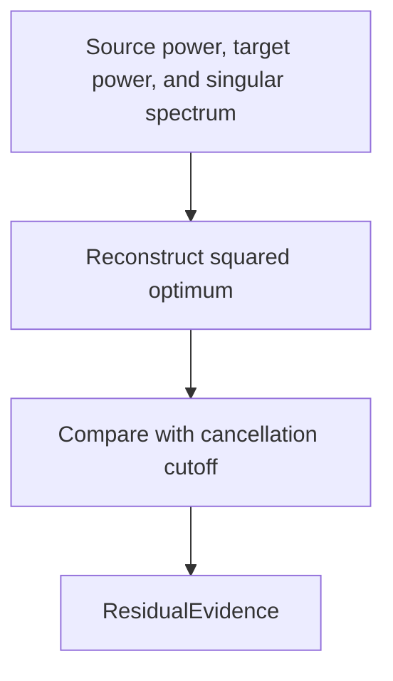

# Schematics

```mermaid
flowchart TD
    Inputs[Source power, target power, and singular spectrum] --> Reconstruct[Reconstruct squared optimum]
    Reconstruct --> Compare[Compare with cancellation cutoff]
    Compare --> Evidence[ResidualEvidence]
```
