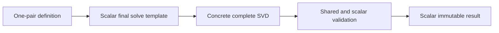

# Scalar solver schematics

```mermaid
flowchart LR
    D[One-pair definition] --> S[Scalar final solve template]
    S --> B[Concrete complete SVD]
    B --> V[Shared and scalar validation]
    V --> R[Scalar immutable result]
```
