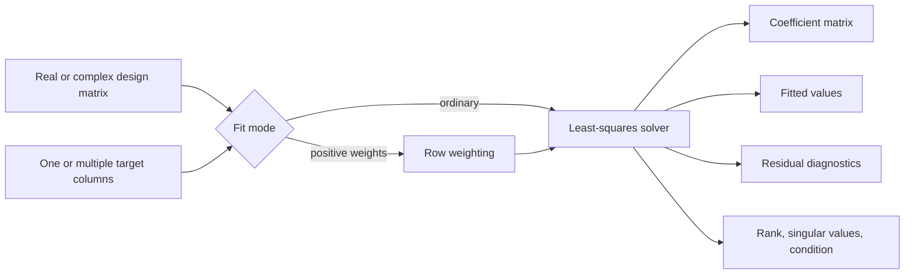
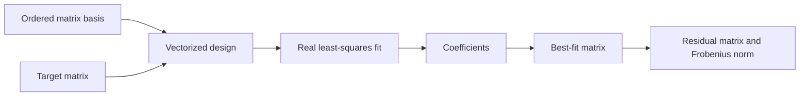
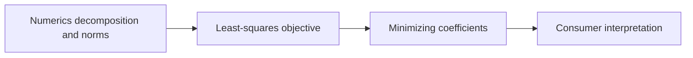

# Least-squares schematics

## Ordinary and weighted linear least squares

```mermaid
flowchart LR
    D[Real or complex design matrix] --> M{Fit mode}
    T[One or multiple target columns] --> M
    M -->|ordinary| S[Least-squares solver]
    M -->|positive weights| W[Row weighting]
    W --> S
    S --> C[Coefficient matrix]
    S --> F[Fitted values]
    S --> R[Residual diagnostics]
    S --> K[Rank, singular values, condition]
```

## Matrix-subspace fit

```mermaid
flowchart LR
    B[Ordered matrix basis] --> V[Vectorized design]
    A[Target matrix] --> V
    V --> S[Real least-squares fit]
    S --> C[Coefficients]
    C --> M[Best-fit matrix]
    M --> R[Residual matrix and Frobenius norm]
```

## Ownership split

```mermaid
flowchart LR
    N[Numerics decomposition and norms] --> O[Least-squares objective]
    O --> P[Minimizing coefficients]
    P --> C[Consumer interpretation]
```
