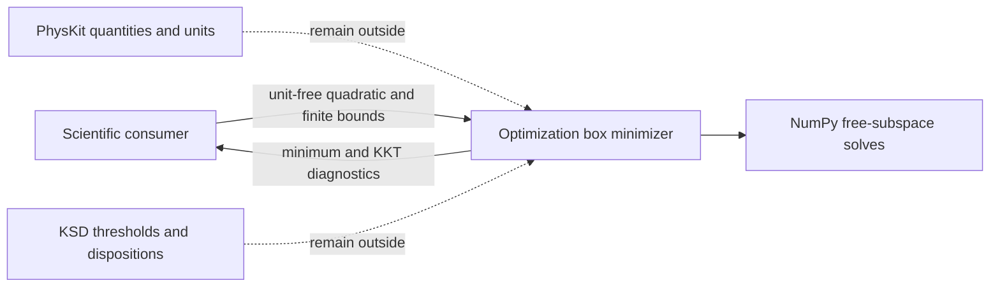
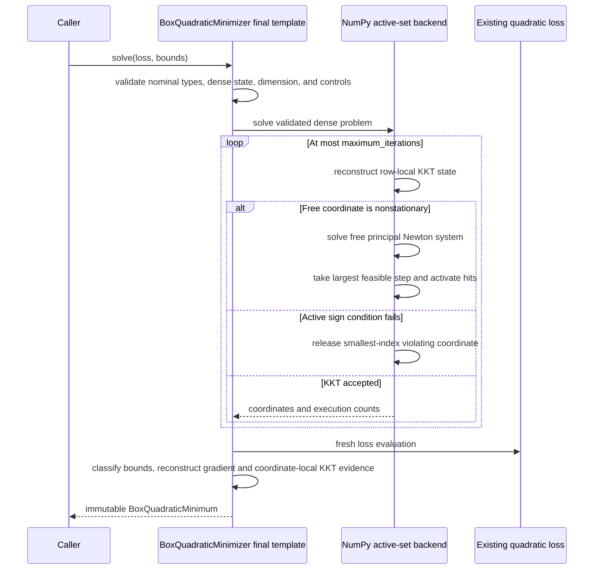
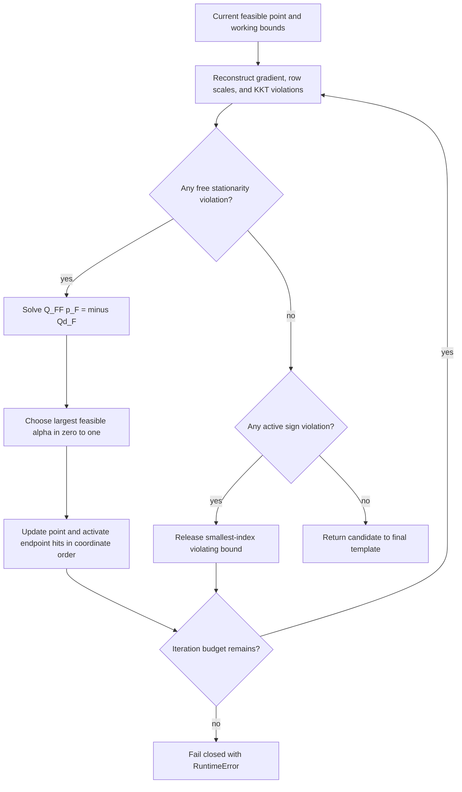

# Schematics

## Ownership

```mermaid
flowchart LR
    C[Scientific consumer] -->|unit-free quadratic and finite bounds| O[Optimization box minimizer]
    O -->|minimum and KKT diagnostics| C
    O --> N[NumPy free-subspace solves]
    P[PhysKit quantities and units] -. remain outside .-> O
    K[KSD thresholds and dispositions] -. remain outside .-> O
```

## Final template

```mermaid
sequenceDiagram
    participant C as Caller
    participant T as BoxQuadraticMinimizer final template
    participant B as NumPy active-set backend
    participant Q as Existing quadratic loss

    C->>T: solve(loss, bounds)
    T->>T: validate nominal types, dense state, dimension, and controls
    T->>B: solve validated dense problem
    loop At most maximum_iterations
        B->>B: reconstruct row-local KKT state
        alt Free coordinate is nonstationary
            B->>B: solve free principal Newton system
            B->>B: take largest feasible step and activate hits
        else Active sign condition fails
            B->>B: release smallest-index violating coordinate
        else KKT accepted
            B-->>T: coordinates and execution counts
        end
    end
    T->>Q: fresh loss evaluation
    T->>T: classify bounds, reconstruct gradient and coordinate-local KKT evidence
    T-->>C: immutable BoxQuadraticMinimum
```

## One active-set transition

```mermaid
flowchart TD
    S[Current feasible point and working bounds] --> K[Reconstruct gradient, row scales, and KKT violations]
    K --> F{Any free stationarity violation?}
    F -- yes --> L[Solve Q_FF p_F = minus Qd_F]
    L --> A[Choose largest feasible alpha in zero to one]
    A --> H[Update point and activate endpoint hits in coordinate order]
    F -- no --> V{Any active sign violation?}
    V -- yes --> R[Release smallest-index violating bound]
    V -- no --> O[Return candidate to final template]
    H --> N{Iteration budget remains?}
    R --> N
    N -- yes --> K
    N -- no --> X[Fail closed with RuntimeError]
```
