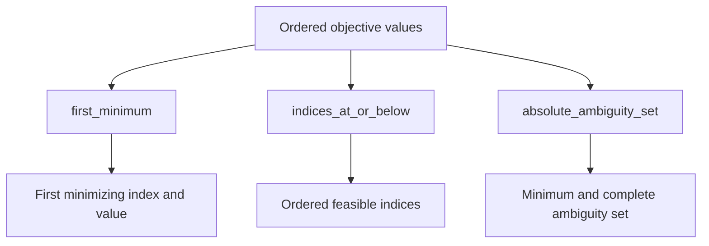
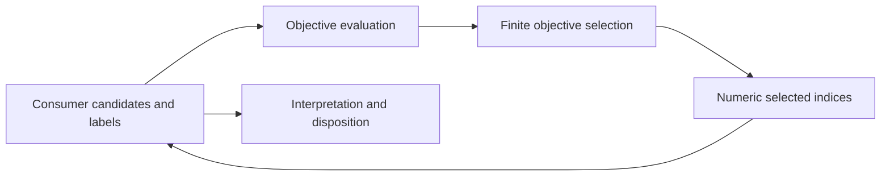

# Finite-selection schematics

## Selection operations

```mermaid
flowchart TD
    V[Ordered objective values] --> M[first_minimum]
    V --> C[indices_at_or_below]
    V --> A[absolute_ambiguity_set]
    M --> MR[First minimizing index and value]
    C --> CR[Ordered feasible indices]
    A --> AR[Minimum and complete ambiguity set]
```

## Consumer composition

```mermaid
flowchart LR
    C[Consumer candidates and labels] --> E[Objective evaluation]
    E --> S[Finite objective selection]
    S --> I[Numeric selected indices]
    I --> C
    C --> D[Interpretation and disposition]
```

Selection never stores consumer labels or assigns scientific meaning to ceilings and
tolerances.
