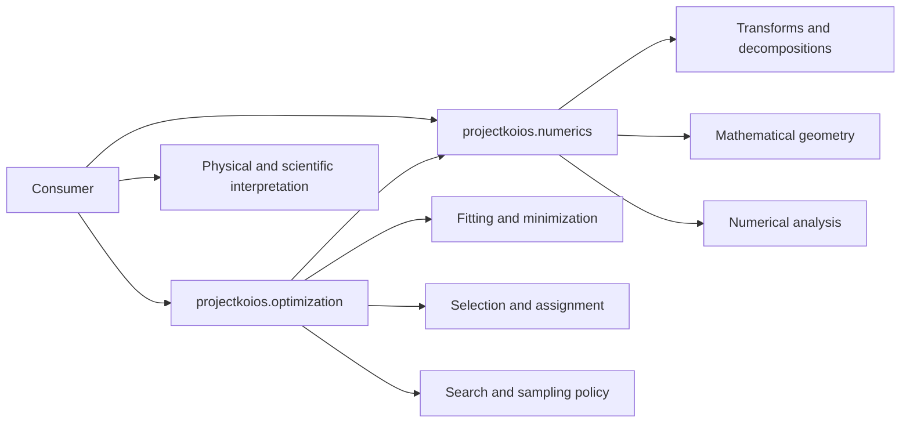
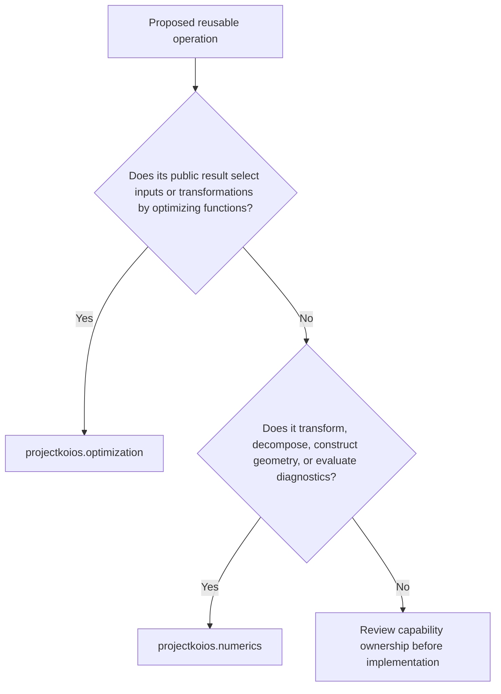
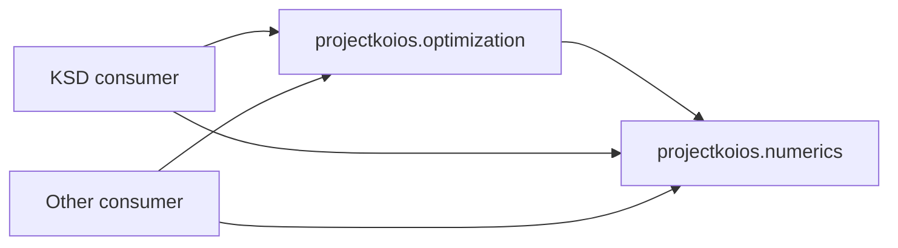

# Schematics

## Namespace ownership

```mermaid
flowchart LR
    C[Consumer] --> N[projectkoios.numerics]
    C --> O[projectkoios.optimization]
    O --> N

    N --> NT[Transforms and decompositions]
    N --> NG[Mathematical geometry]
    N --> NA[Numerical analysis]

    O --> OF[Fitting and minimization]
    O --> OS[Selection and assignment]
    O --> OP[Search and sampling policy]

    C --> I[Physical and scientific interpretation]
```

## Classification decision

```mermaid
flowchart TD
    A[Proposed reusable operation] --> B{Does its public result select inputs or transformations by optimizing functions?}
    B -->|Yes| O[projectkoios.optimization]
    B -->|No| C{Does it transform, decompose, construct geometry, or evaluate diagnostics?}
    C -->|Yes| N[projectkoios.numerics]
    C -->|No| D[Review capability ownership before implementation]
```

## Dependency direction

```mermaid
flowchart LR
    O[projectkoios.optimization] --> N[projectkoios.numerics]
    K[KSD consumer] --> O
    K --> N
    X[Other consumer] --> O
    X --> N
```

There is no arrow from Numerics to Optimization and no arrow from either owned namespace
to a consumer.
